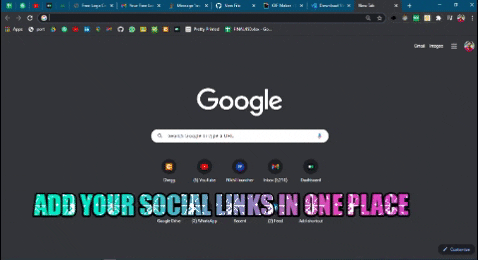

# Socila Links Extension

# Chrome Extesnion as a personal launcher

This is a kind of launcher application extension used for adding all your social links at one place.
Get access of all your social media handles isn't a good idea.
If yes, checkout the code and make your own.
or if you want me to do this for you, I'll be happy for doing this at just $2

## Technologies I used

- HTML
- CSS

## Installation of linkextension To Your Machine.

Clone this repo to your machine. If you need help with this part, GitHub has [great documentation](https://help.github.com/articles/fork-a-repo/)

## This is how the extension looks:



I have done this whole Project in Visual Studio code. if you don't have Visual Studio code setup in ur computer ,download it by [clicking here](https://code.visualstudio.com/Download)

## About the author

[LinkedIn - Nikhil Mahajan](https://www.linkedin.com/in/nikhil-mahajan-92b9631a0/ "Nikhil Mahajan's LinkedIn profile")

[Web - Nikhil Mahaan](https://nikhilmahajan.netlify.app/ "Nikhil Mahajan Portfolio")

```

```
